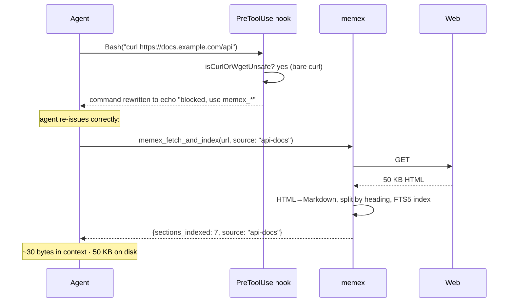
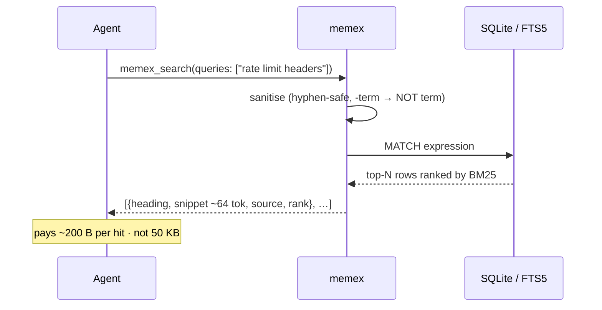
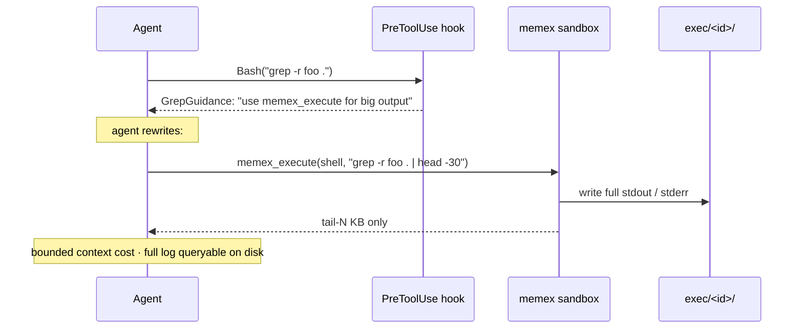

# memex

A local context-management daemon for AI coding agents. `memex` ships
three things in one binary:

- An **MCP server** (stdio JSON-RPC) exposing tools that index, search,
  fetch, and execute code through a per-user SQLite/FTS5 knowledge base
  and a sandboxed code executor.
- **PreToolUse / PostToolUse / SessionStart / PreCompact hooks** that
  route an agent's tool calls (WebFetch, Read, Grep, Bash, subagent
  spawns) through the local KB instead of burning context on raw I/O.
- A **`setup install` installer** that wires both into Claude Code,
  Codex, Cursor, Gemini CLI, or VS Code Copilot on the host machine.

## How it works

memex sits between your AI agent and the things it might want to read
— web pages, files, command output, code execution. Its single job is
to keep the **context window** (what the model sees in any one
message) small while keeping the *answers* available.

### The problem

An agent's context window is finite and every byte in it costs money
and crowds out reasoning. The default tools dump bulk content straight
into it:

- `WebFetch(url)` → the whole HTML body lands in context.
- `Read(file)` → the whole file lands in context.
- `Bash("curl …")` → curl's stdout lands in context.
- `Grep("foo", -r)` → every match line lands in context.

A 50 KB doc costs you 50 KB *every time the agent thinks about it*. A
200-file recursive grep can blow through a context budget in a single
call.

### The fix: index once, project per query

memex flips the flow. Bulk content gets **stored** in a local
SQLite/FTS5 knowledge base at `~/.local/share/memex/kb.sqlite`. The
agent's context only ever sees the small **answer-shaped slice** it
actually needed.

```
without memex                       with memex
─────────────                       ──────────

  ┌─────────┐                         ┌─────────┐
  │  Agent  │                         │  Agent  │
  └────┬────┘                         └────┬────┘
       │ WebFetch                          │ WebFetch / curl / Read
       │   (50 KB)                         │      ↓ hook intercepts
       ▼                                   │   ┌─────────┐
  ┌─────────┐                              ├──▶│  memex  │ ─→ SQLite
  │ Context │                              │   └────┬────┘   (50 KB on disk)
  │  50 KB  │                              │        │ "indexed 7 sections"
  └─────────┘                              ▼        ▼
                                      ┌──────────────┐
                                      │   Context    │
                                      │   ~30 bytes  │
                                      └──────────────┘

cost per fetch: 50 KB              cost per fetch: ~30 B  (+ 50 KB on disk, forever)
cost per re-ask: 50 KB             cost per query: ~200 B (one ranked snippet)
```

### Three interception points

#### 1. Network in → KB (WebFetch / curl / wget)

Hooks intercept any tool call that would dump remote bytes into
context. WebFetch is denied with a redirect message. Bash is scanned
per-segment for `curl`/`wget` and inline HTTP (`fetch(`,
`requests.get(`, `http.get(`); unsafe forms (bare, verbose, or
stdout-aliased) are rewritten to an `echo` that points at
`memex_fetch_and_index`. Forms that redirect to a file
(`curl -o page.html`, `> file`) are left alone — they don't flood
context.



#### 2. KB → focused snippet (search)

When the agent later asks a question, `memex_search` runs FTS5 BM25
ranking against the indexed corpus and returns at most *N*
`SearchResult{Heading, Body, Snippet, Source, Rank}` entries. The
`Snippet` is hard-capped at 64 tokens (see `snippetTokens` in
`internal/kb/search.go`), so per-query context cost is **O(N × 64)
regardless of corpus size**.



#### 3. Code → only the answer (execute)

`memex_execute(language, code)` runs shell / python / javascript /
typescript in a sandbox under `~/.local/share/memex/exec/<id>/`. Full
stdout and stderr stream to disk; only the last few KB return to the
agent. Same shape for `memex_execute_file` (run code against a file
path) and `memex_batch_execute` (multiple commands + searches in a
single round-trip).



### Net effect

|                       | Without memex             | With memex                                |
| --------------------- | ------------------------- | ----------------------------------------- |
| Fetch a 50 KB doc     | 50 KB into context        | ~30 B into context · 50 KB on disk        |
| Re-ask about that doc | 50 KB into context again  | ~200 B per query (one snippet)            |
| Grep 200 files        | every match line          | tail of N matches you asked for           |
| Run a noisy build     | full stdout in context    | last few KB; full log on disk             |

The model still gets the information — just the *answer-shaped slice*
rather than the haystack. Index cost is paid once at fetch time;
slice cost is paid per question, regardless of corpus size or how
many sessions you spread the work across.

## Install on a new machine

Requirements: Go ≥ 1.25 on PATH (Go ≥ 1.21 will auto-fetch the right
toolchain), an HTTP-reachable `proxy.golang.org`, and one of the
supported host agents below.

### One-liner

```sh
curl -fsSL https://raw.githubusercontent.com/dreamware-nz/memex/main/install.sh | sh
```

This runs [`install.sh`](./install.sh) which: builds memex via
`go install`, places it in `$(go env GOBIN || go env GOPATH/bin)`,
wires it into the auto-detected host agent via `memex setup install`,
and runs `memex setup validate` to confirm.

### Manual

```sh
go install github.com/dreamware-nz/memex/cmd/memex@latest
export PATH="$(go env GOBIN || echo $(go env GOPATH)/bin):$PATH"
memex setup install      # auto-detect host; --platform <id> to override
memex setup validate
```

`setup install` records the running binary's absolute path in the
host agent's hook commands and `.mcp.json`, so wherever you put `memex`
is where the agent will find it.

**For Claude Code users: fully quit and reopen Claude Code after
`setup install`.** MCP servers declared in plugin `.mcp.json` files are
loaded only at startup; an in-flight `/clear` will not pick them up.
After restart, the `mcp__plugin_memex_memex__*` tools appear in the
tool list and the PreToolUse hook starts routing through them.

### Supported host platforms

| Platform ID      | Notes                                                |
| ---------------- | ---------------------------------------------------- |
| `claude-code`    | Plugin tree under `~/.claude/plugins/`               |
| `codex`          | `~/.codex/` config + hooks                           |
| `cursor`         | Cursor extension settings                            |
| `gemini-cli`     | `~/.config/gemini/` settings                         |
| `vscode-copilot` | VS Code Copilot user settings                        |

Auto-detection picks the most-recently-used host. Override with
`--platform <id>`.

## Update

```sh
go install github.com/dreamware-nz/memex/cmd/memex@latest
memex setup install     # re-stamps hook & .mcp.json paths
```

Then **fully quit and reopen Claude Code** (or your host agent) so the
MCP server reloads the new binary — an in-flight session keeps running
the old one until restart.

`memex_upgrade` (the MCP tool) returns this same command so an agent
can self-upgrade on request.

## Uninstall

```sh
memex setup uninstall            # remove hooks, plugin manifest, skills
rm "$(which memex)"              # remove the binary
```

The local SQLite KB at `~/.local/share/memex/kb.sqlite` and analytics
at `~/.local/share/memex/session/analytics.db` are not deleted by
`uninstall`. To remove them, call the `memex_purge` MCP tool with
`confirm: true`, or delete the files by hand.

## Layout

- `cmd/memex/` — CLI entrypoint
- `internal/kb/` — SQLite + FTS5 knowledge base (index + search)
- `internal/sandbox/` — sandboxed code executor (shell, python, node)
- `internal/mcp/` — stdio JSON-RPC MCP server + tool dispatcher
- `internal/hooks/` — agent hook subcommands and PreToolUse routing
- `internal/adapters/` — per-host install / config / detection
- `internal/session/` — session event tracking
- `internal/fetch/` — HTTP fetch + HTML→Markdown conversion
- `internal/skills/` — embedded skill bundle (`assets/`) + writers

## Build from source

```sh
git clone https://github.com/dreamware-nz/memex.git
cd memex
go build ./cmd/memex      # produces ./memex in repo root
go test ./...
```

## License

TBD.
